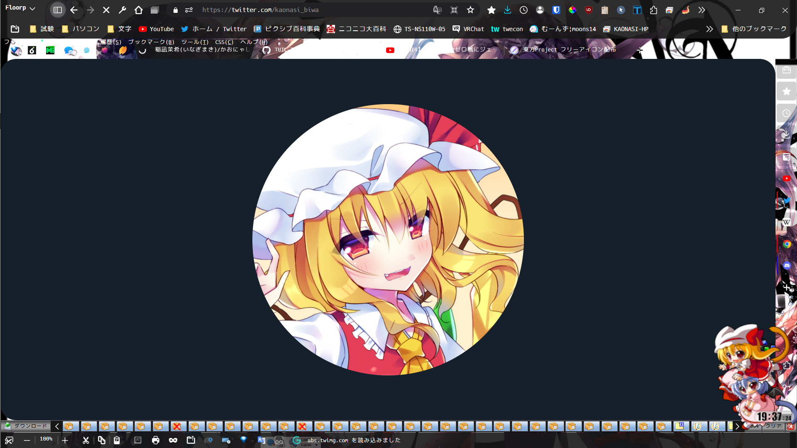
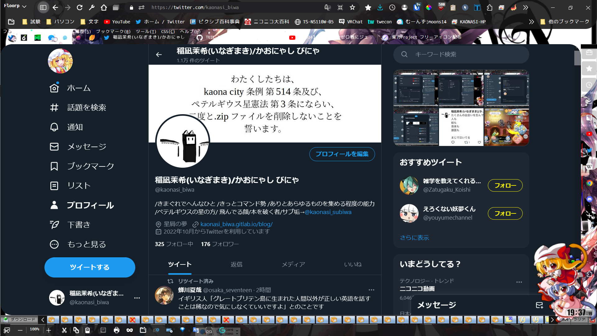

# defaultTwitterColor
↓こちらをコピーしてください
```
[class*="TUICTwitterIcon_IconImg"]:not(#placeholder *)
{
  width: 64px !important;
}

#placeholder [class*="TUICTwitterIcon_IconImg"]
{
  width: 75vmin !important;
}
```
## 使用例
使わせていただいたアイコン  
→[東方Project フリーアイコン配布](https://duno.jp/articles/free-icons)  
  
